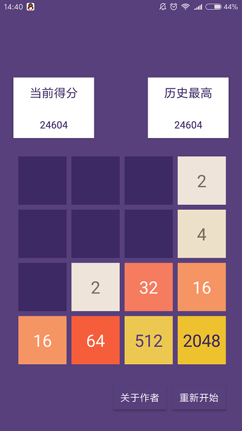
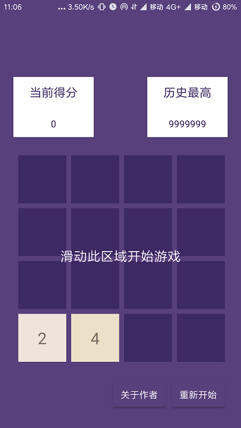
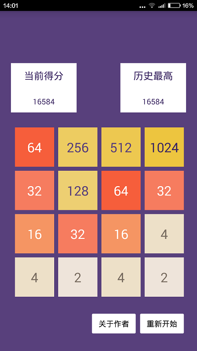

# 2048小游戏安卓版

## 说明

本项目根据“极客学院”中2048游戏视频教程总结编写而成

+ 完成时间：2018年2月

+ Android Studio版本：2.2.3

+ 个人博客地址：https://lthergo.com


## 游戏界面
  


## 布局分析
我通过在res/values/styles.xml中修改actionbar为NoActionBar来隐藏这一栏`<style name="AppTheme" parent="Theme.AppCompat.Light.NoActionBar">`，在Theme Editor中修改它自带的colorPrimaryDark和colorAccent的颜色为紫色，来实现顶部Status和所有提示布局颜色为紫色，实现游戏的伪全屏（更美观）。左上角和右上角通过两个包裹好的TextView来实现显示当前得分和历史最高得分。中间深紫色的游戏布局，则是通过函数来实现的动态游戏界面，它需要通过引入包名和类名来置入，在AS中调试的时候我发现布局界面无法显示游戏实现的动态区域，提示Rendering Problems而无法加载布局，而把此游戏实现区域注释掉后则能显示布局
```
            <com.lthergo.game2048.GameView
                android:id="@+id/gameView"
                android:layout_width="fill_parent"
                android:layout_height="fill_parent" >
            </com.lthergo.game2048.GameView>

            <com.lthergo.game2048.AnimLayer
                android:id="@+id/animLayer"
                android:layout_width="fill_parent"
                android:layout_height="fill_parent" >
            </com.lthergo.game2048.AnimLayer>

```
而底部则设置了两个Button来实现查看作者信息和重新开始游戏的操作。
**==布局请一定用代码来操作!不要在可视界面拖拽，不然会浪费很多时间！==**

## 游戏实现的主要方法
##### 判断操作者的滑动方向
通过初始和终止的两个坐标，比较它们的x和y的值判断最终手指滑动方向
```
setOnTouchListener(new OnTouchListener() {       
            private float startX,startY,offsetX,offsetY;        
           // startX,startY表示用户滑动起始位置，offsetX,offsetY则表示末尾的位置  
            public boolean onTouch(View v, MotionEvent event) {
                switch (event.getAction()) {
                case MotionEvent.ACTION_DOWN:
                    startX = event.getX();
                    startY = event.getY();
                    break;
                case MotionEvent.ACTION_UP:
                    offsetX = event.getX()-startX;
                    offsetY = event.getY()-startY;

                    //在水平方向上移动
                    if(Math.abs(offsetX)>Math.abs(offsetY)){
                        //向左滑动
                        if(offsetX<-5){// 设置为“-5”是为了容错，因为数据存储精度原因
                            swipeLeft();
                        //向右滑动
                        }else if(offsetX>5){
                            swipeRight();
                        }
                    }else{
                        //向上滑动
                        if(offsetY<-5){
                            swipeUp();
                        //向下滑动
                        }else if(offsetY>5){
                            swipeDown();
                        }
                    }
                    break;
                default:
                    break;
                }
                return true;
            }
        });
```
##### 滑动后的变化
假设为向左滑动，且为16个方块，将游戏界面定义为4*4的16个方块，将这16个方块里每个方块的值和它左边方块里的值进行判断。如果它左边的方块为空，则将它的值传递到左边，直到左边不为空或超出边界为止。如果它左边的方块和它的值相等，则把它的值的两倍传递给左边，并把它“清除”（颜色设定为方块背景色）
```
   private void swipeLeft(){

        MainActivity.getMainActivity().showStart();
        boolean merge = false;
        //从上至下的第一行开始
        for (int y = 0; y < Config.LINES; y++) { //从左至右
            for (int x = 0; x < Config.LINES; x++) {

                for (int x1 = x+1; x1 < Config.LINES; x1++) { //当前位置上的值不为0
                    if (cardsMap[x1][y].getNum()>0) {
//当前方块左边的方块为空，则将当前方块的值传到左边，直到左边是不为空的方块为止
                        if (cardsMap[x][y].getNum()<=0) {

                            MainActivity.getMainActivity().getAnimLayer().createMoveAnim(cardsMap[x1][y],cardsMap[x][y], x1, x, y, y);

                            cardsMap[x][y].setNum(cardsMap[x1][y].getNum());
                            cardsMap[x1][y].setNum(0);

                            x--;
                            merge = true;
//左边卡片的值不为空且与当前值当等
                        }else if (cardsMap[x][y].equals(cardsMap[x1][y])) {
                            MainActivity.getMainActivity().getAnimLayer().createMoveAnim(cardsMap[x1][y], cardsMap[x][y],x1, x, y, y);
                            cardsMap[x][y].setNum(cardsMap[x][y].getNum()*2);
                            cardsMap[x1][y].setNum(0);

                            MainActivity.getMainActivity().addScore(cardsMap[x][y].getNum());
                            merge = true;
                        }

                        break;
                    }
                }
            }
        }

        if (merge) {
            addRandomNum();//完成后再添加一个随机数字
            checkComplete();//并判断游戏是否结束
        }
    }
```
还有若干方法的实现需要考虑，比如卡片的大小和对应的不同尺寸的手机自适应，不同数值对应的卡片背景颜色的设置，判断游戏初始化和每次滑动添加随机数卡片，记分并显示当前分数和最高分保存，判断游戏是否结束并弹窗等等，不一一累赘了
## 部分Bug
在发给我朋友测试的过程中，发现了安卓系统版本不同所导致的若干问题  
小米4（Android4.4）  
游戏界面布局不一样，似乎变成默认的了，比如Button的样式，StatusBar不显示等等，暂时不知道问题出在哪，暂时并无大碍，可能是Android版本问题导致的AppCompat不同吧，但是打包编译过后应该不会这样啊orz，于是我修改了一点布局样式让在4.4系统中也较为美观  
  
Android7.0及以上版本  
最开始打开游戏时候gameview的区域不显示，而需要初次滑动之后才显示游戏gameview区域，我试过在游戏初始化添加swipeleft（right，up，down）等操作模拟滑动，可是还是不显示。这一现象只在高版本的安卓系统才出现，结合在布局界面出现的Rendering Problems，我认为应该是同一个问题。最终我只能在初始化界面加了一个TextView提示游戏已经正常打开，在执行任意一方向滑动操作后将此TextView去除，这样只是不好看了点  
  
#####更多代码详解，请访问我的博客：
https://lthergo.com/game2048.html
